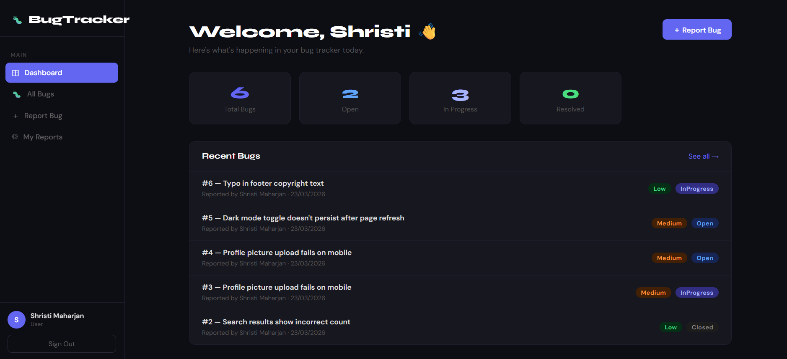
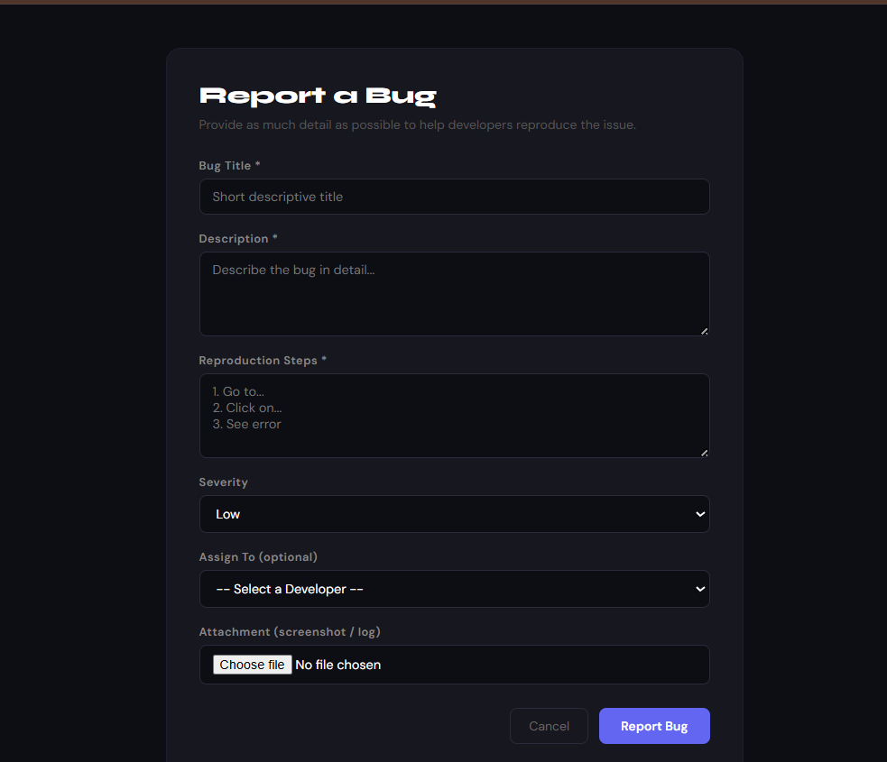
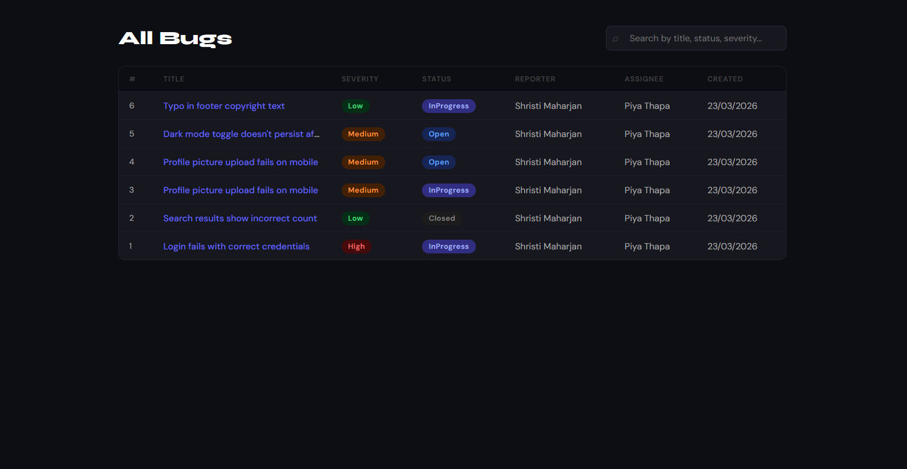

# Bug Tracking System

A full-stack bug tracking web application built with **React + TypeScript** on the frontend and **.NET 9 Web API** on the backend. Supports role-based workflows for users reporting bugs and developers triaging and resolving them.

---

## Features

### For Users
- Register and log in with JWT-based authentication
- Report bugs with title, description, severity level, and reproduction steps
- Attach files (screenshots, logs) to bug reports
- View and track your own submitted bugs

### For Developers
- Browse all unassigned bugs with search/filter
- Self-assign bugs from the unassigned queue
- Progress bugs through a status workflow: `Open → In Progress → Resolved → Closed`

### System
- Role-based access control (User vs Developer) enforced on both frontend and API
- Protected routes on the frontend; role-checked endpoints on the backend
- Global exception handling middleware with consistent error responses
- Swagger / OpenAPI documentation for all endpoints

---

## Tech Stack

| Layer    | Technology                                      |
| -------- | ----------------------------------------------- |
| Frontend | React 18, TypeScript, Redux Toolkit, Axios       |
| Backend  | .NET 9, ASP.NET Core Web API                    |
| Auth     | ASP.NET Core Identity + JWT Bearer              |
| ORM      | Entity Framework Core 9 (Code-First Migrations) |
| Database | SQL Server                                      |
| Docs     | Swagger / OpenAPI                               |

---

## Architecture

The backend follows a layered architecture with clean separation of concerns:

```
Controllers  →  Services (business logic)  →  Repositories (EF Core)
```

- **Controllers** handle HTTP routing and input validation
- **Services** contain all business logic and are injected via interfaces
- **EF Core** handles database access with Code-First migrations
- **ASP.NET Core Identity** manages users and roles
- **JWT middleware** protects endpoints and carries role claims

The frontend uses Redux Toolkit for state management with an Axios interceptor that automatically attaches JWT tokens to every request.

---

## Project Structure

```
BugTracker/
├── BugTracker.API/
│   ├── Controllers/
│   │   ├── AuthController.cs        ← Register, Login
│   │   └── BugsController.cs        ← CRUD, assign, status, attachments
│   ├── Data/
│   │   └── AppDbContext.cs
│   ├── DTOs/
│   │   └── Dtos.cs
│   ├── Middleware/
│   │   └── ExceptionMiddleware.cs
│   ├── Models/
│   │   ├── AppUser.cs
│   │   ├── Bug.cs
│   │   └── BugAttachment.cs
│   ├── Services/
│   │   ├── IServices.cs
│   │   ├── AuthService.cs
│   │   └── BugService.cs
│   └── Program.cs
│
└── BugTracker.Frontend/
    └── src/
        ├── components/
        ├── hooks/
        ├── pages/
        │   ├── LoginPage.tsx
        │   ├── RegisterPage.tsx
        │   ├── Dashboard.tsx
        │   ├── BugsPage.tsx
        │   ├── ReportBugPage.tsx
        │   ├── MyBugsPage.tsx
        │   └── UnassignedPage.tsx
        ├── services/
        │   └── api.ts               ← Axios instance + JWT interceptor
        ├── store/
        │   ├── authSlice.ts
        │   └── bugsSlice.ts
        └── App.tsx                  ← Routes + protected layout
```

---

## API Endpoints

### Auth

| Method | Endpoint             | Auth | Description       |
| ------ | -------------------- | ---- | ----------------- |
| POST   | `/api/auth/register` | ❌   | Register new user |
| POST   | `/api/auth/login`    | ❌   | Login, get JWT    |

### Bugs

| Method | Endpoint                     | Auth | Role      | Description                             |
| ------ | ---------------------------- | ---- | --------- | --------------------------------------- |
| GET    | `/api/bugs`                  | ✅   | Any       | Get all bugs (supports `?search=`)      |
| GET    | `/api/bugs/{id}`             | ✅   | Any       | Get bug by ID                           |
| GET    | `/api/bugs/my`               | ✅   | Any       | Get my reported bugs                    |
| GET    | `/api/bugs/unassigned`       | ✅   | Developer | Get unassigned bugs                     |
| GET    | `/api/bugs/developers`       | ✅   | Developer | List all developers                     |
| POST   | `/api/bugs`                  | ✅   | Any       | Report a new bug                        |
| PUT    | `/api/bugs/{id}/assign`      | ✅   | Developer | Assign bug to self                      |
| PUT    | `/api/bugs/{id}/status`      | ✅   | Developer | Update bug status                       |
| POST   | `/api/bugs/{id}/attachments` | ✅   | Any       | Upload file attachment                  |

---

## Getting Started

### Prerequisites

- [.NET 9 SDK](https://dotnet.microsoft.com/download)
- [Node.js >= 16](https://nodejs.org/)
- [SQL Server](https://www.microsoft.com/en-us/sql-server) (local or Express edition)

### Backend Setup

```bash
cd BugTracker.API

# Install EF Core CLI (if not already installed)
dotnet tool install --global dotnet-ef

# Restore packages
dotnet restore

# Update connection string in appsettings.json (see Configuration below)

# Run migrations
dotnet ef database update

# Start the API
dotnet run
```

API runs at `http://localhost:55578`  
Swagger UI at `http://localhost:55578/swagger`

### Frontend Setup

```bash
cd BugTracker.Frontend

npm install
npm start
```

Frontend runs at `http://localhost:3000`

---

## Configuration

Create or update `BugTracker.API/appsettings.Development.json`:

```json
{
  "ConnectionStrings": {
    "Default": "Server=localhost;Database=BugTrackerDb;Trusted_Connection=True;TrustServerCertificate=True;"
  },
  "Jwt": {
    "Key": "your-secret-key-here",
    "Issuer": "BugTrackerAPI",
    "Audience": "BugTrackerClient"
  }
}
```

> **Note:** Never commit real secrets to source control. Use environment variables or user secrets in production.

---

## Screenshots





---

## Author

[Shristi](https://github.com/shristii123)
